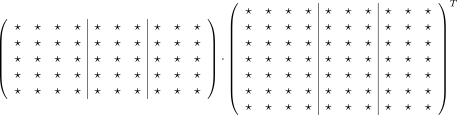

# Project 2

This project is the second part of a three-part series focusing on matrix multiplication and its optimization. In this part, we implement a distributed matrix multiplication using MPI. Your code need to be tested on the CECI cluster.

## Requirements

This project must be implemented using only the C++ Standard Library and MPI. No other libraries or dependencies are allowed. This ensures portability.

## Tasks

The `DistributedMatrix` class should implement the member functions (or *methods*) as defined in the `distributedmatrix.hpp` file (and tested in the `distributedtests.cpp` file).

In our case, we will split the matrix by columns into parts as equal as possible. Here is a visual example of how the product between a distributed matrix and another distributed matrix transposed is split for 3 processes:

where the first 4 columns are on the first process, the 3 next are stored on the second one, and the 3 last columns on the third process.

Remark that both matrices have the same split of their columns across processes. You should ensure that your constructor partition deterministically the columns among the processes, such that you can assume this property for your implementation of your methods such as the `multiplyTransposed` method.

Note that your implementation of `DistributedMatrix` is used to train a neural network in parallel in `mlp_sgd_distributed.cpp`.

## Questions

1. In the distributed MLP implementation (`mlp_sgd_distributed.cpp`), how does the currently implemented distributed gradient computation would compare to: partitioning the data among process; computing the gradient independently on each process; then synchronize the obtained gradients ?
2. Analyze and profile the communication overhead (MPI operations) versus actual computation time in the `DistributedMatrix::multiplyTransposed` using [NVIDIA Nsight Systems](https://developer.nvidia.com/nsight-systems).
3. What is the expected speed up for the distributed `DistributedMatrix::multiplyTransposed` operation ? Compare this with the speed up you measure on your numerical experiments.

## Guidelines

 - **Deadline**: The deadline is the Thursday 10th April 23h59.
 - **Fraud**:  As always for this course, you must do all the writing (report, code) <ins>individually</ins>. Never share your production. However, you are allowed, and even encouraged, to exchange ideas on how to address the assignment.
 - **Plagiarism**: As always, you must cite all your sources.
 - **Report Submission**: Using the Moodle assignment activity, submit your report in a file called `Report_Project_2_FirstName_LastName.pdf`. The report should be short (maximum 2 pages for the text, the tables and images can be in additional pages) and should include answers to the questions.
 - **Code Submission**: On Inginious, submit your files `distributedmatrix.cpp`, `distributedmatrix.hpp` containing your implementation of the `DistributedMatrix` class. You are allowed to make as many submission as you need, only the last submission will be taken into account. You are advised to verify that your submission passes the tests in Inginious early before the deadline. Note that, even if submitting the code on Inginious is mandatory, the Inginious automatic grading has no influence to the final grading. The tests on Inginious are similar to those included in `distributedtests.cpp`. Since these tests are minimalist, passing them is a necessary but not sufficient condition for having a correct code.
 - **LLM**: The use of artificial intelligence tools is permitted provided that you mention both the AI tool used and the prompts/commands used in the comments of your submitted code and in your report.
 - **Language**: English is the default language. However, since the course is French-friendly, French is accepted without penalty.
 - **Questions**: If you have any questions, please contact the TA: `benoit.loucheur@uclouvain.be` and `brieuc.pinon@uclouvain.be`.
